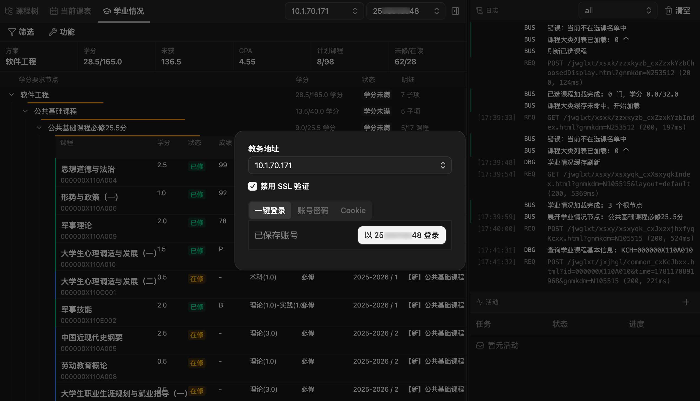
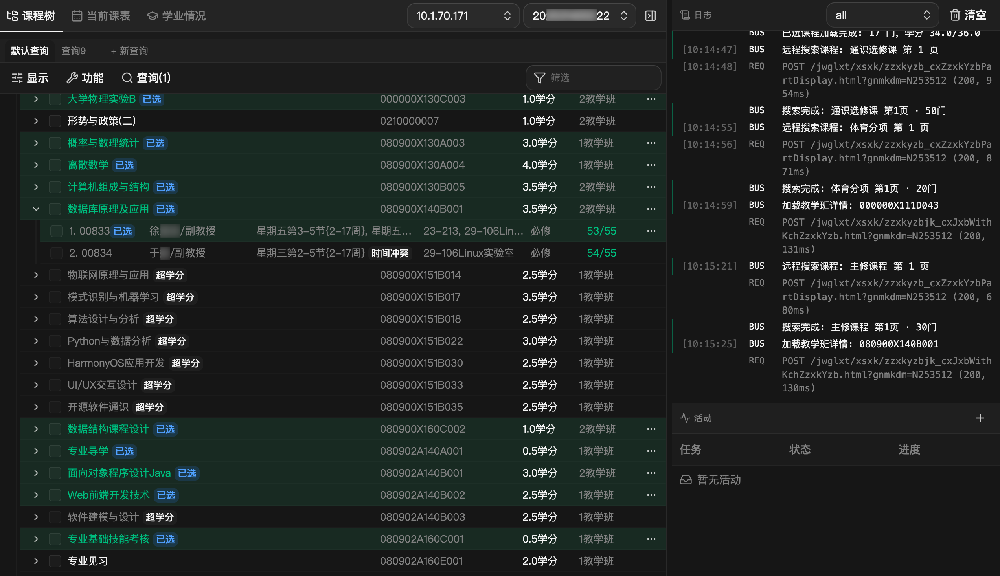
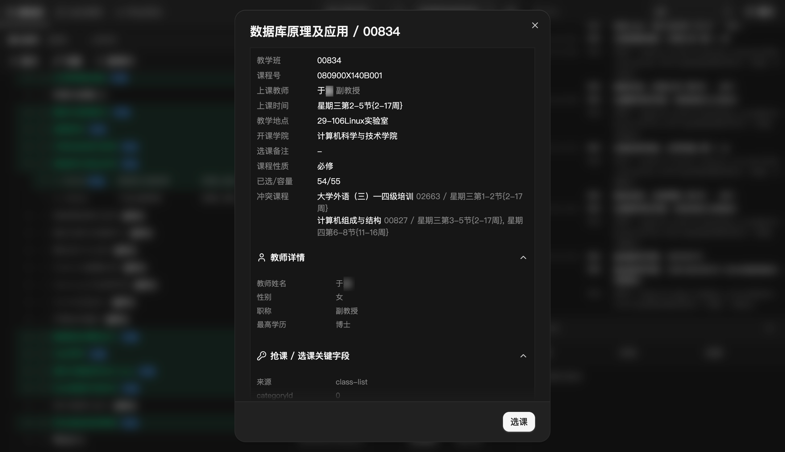
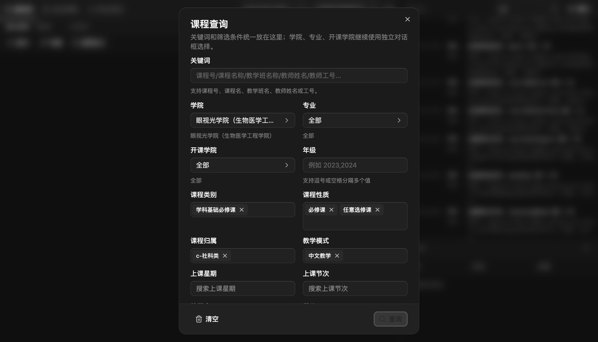
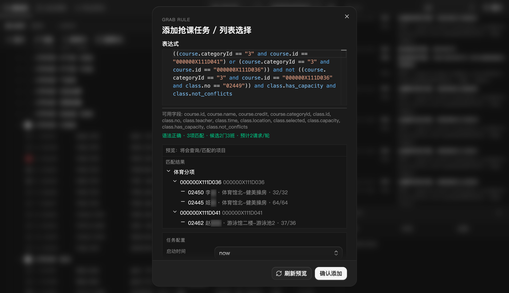
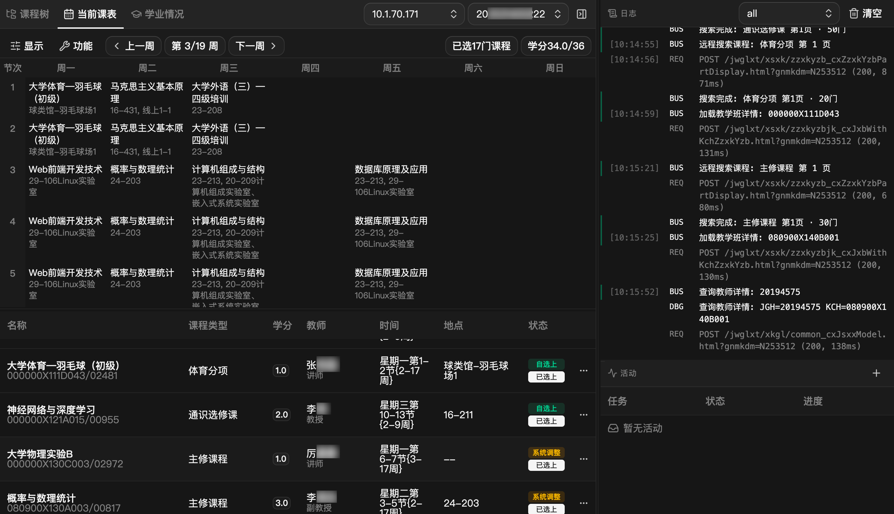
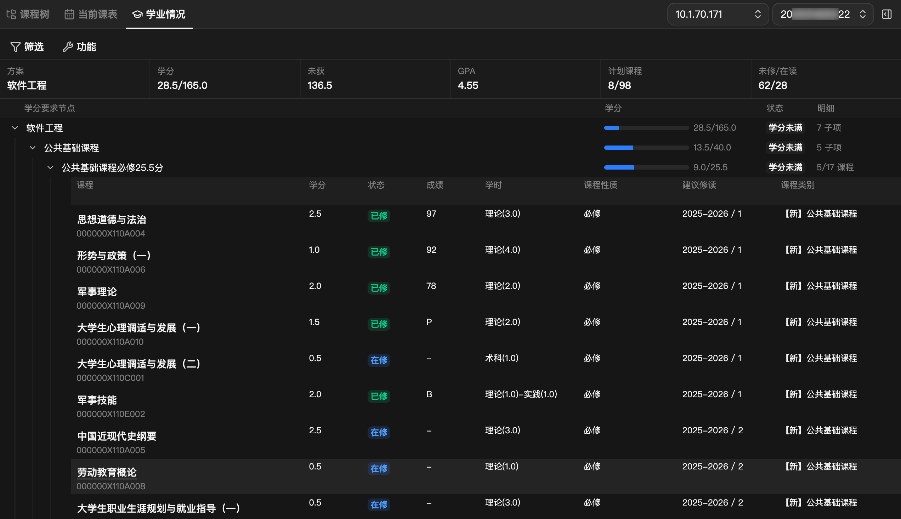
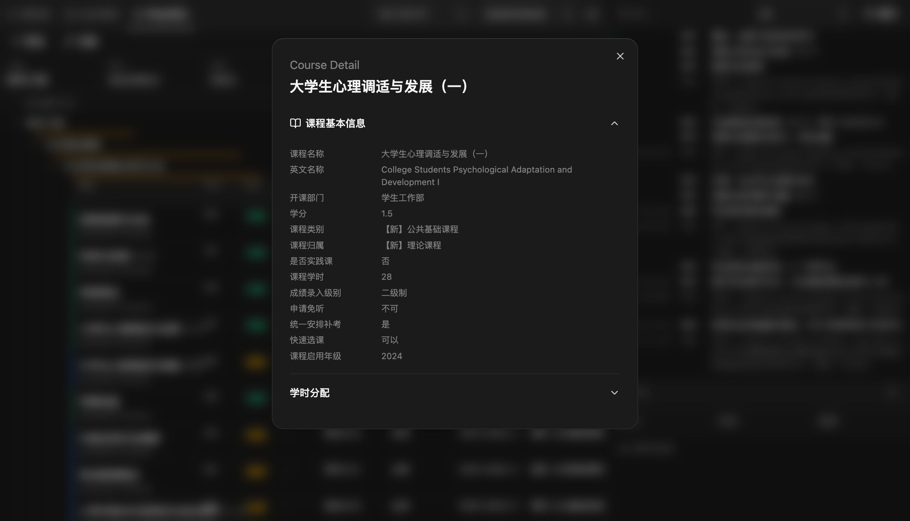
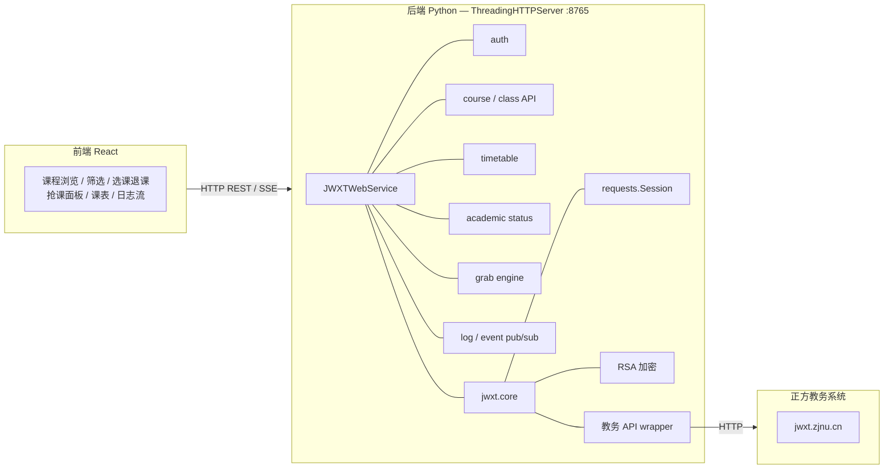

# 正方教务选课工具

适用于正方教务系统的第三方选课 Web 前端。基于正方教务`学生选课`与`学业情况查询`页面接口构建，旨在提升选课体验与个人学业规划。

## 免责声明

本项目仅供学习、研究与技术交流使用，主要用于演示网络请求、流程自动化、界面交互等相关技术。项目开发者不鼓励、不支持任何违反学校规章制度、平台服务协议或相关法律法规的行为。

本项目为独立开发的非官方工具，与“正方软件股份有限公司”、相关高校、教务管理部门及其所属单位不存在任何隶属、合作、授权、认可或其他关联关系。本项目中如涉及任何学校名称、系统名称、平台名称，仅用于说明适配对象或技术研究场景，不代表获得相关权利人的许可、认证或支持。

使用者在使用本项目之前，应自行确认其使用行为符合所在学校、教务系统及相关平台的管理规定、使用协议及适用法律。因使用本项目所产生的一切后果，包括但不限于账号异常、访问受限、数据丢失、选课失败、学业影响、纪律处分或其他直接、间接损失，均由使用者本人承担，与本项目开发者无关。

本项目不保证功能的持续可用性、稳定性、准确性、完整性、时效性或适用于任何特定场景。由于教务系统接口、认证方式、访问策略、验证码机制、频率限制及校方政策可能随时调整，项目可能出现失效、异常或无法达到预期效果的情况，开发者对此不承担责任。

未经相关方明确授权，请勿将本项目用于批量请求、绕过系统限制、干扰平台正常运行、破坏公平选课秩序或其他不当用途。任何基于本项目进行的二次开发、部署、传播或商业化使用，其风险与责任均由使用者自行承担。

使用本项目即视为你已阅读、理解并同意本免责声明的全部内容；如你不同意，请立即停止使用并删除本项目相关内容。

## 功能

适配的接口能力：

- 鉴权
  - 账号密码登录
  - Cookie 登录
- 学生选课
  - 课程/教学班查询检索
  - 选课/退课
  - 课程/教学班详情信息
  - 已选课程列表
- 学业情况
  - 学业情况获取

项目特色功能：

- 现代化 WebUI 界面，以树状列表展示课程
- 纯 api 操作，提高选课效率
- 选课
  - 筛选时间冲突教学班、超学分课程、无余量教学班
  - 抢课引擎 — 基于表达式的可编程自动选课。定义筛选规则（按课程/教学班、教师、时间等），后台轮询检测余量，自动提交抢课。支持定时启停、错误重试、多任务并行
  - 可视化展示已选课程表格
- 学业情况
  - 按学期、课程性质等筛选课程

## 截图

登录

选课与查询



选课表达式

课表

学业情况



## 快速开始

需要 Python >= 3.14，建议使用 uv 管理环境。前端已预构建好

```bash
# 安装 Python 依赖
uv sync

# 启动服务器
uv run python main.py
```

打开 [127.0.0.1:8765](http://127.0.0.1:8765) ，选择教务地址并登录即可使用。 项目在正方教务 V-9.1.064（ZJNU）和 V-9.0（WMU） 上测试成功，因不同高校定制差异，登录逻辑可能不同，但 Cookie 登录应该是通用的。如果您想帮助本项目适配更多高校，参见 贡献指南。

### 选课表达式

表达式使用 Python 语法，对每个候选教学班在运行时 `eval()` 求值，返回 `True` 时提交选课。

| 符号 | 类别 | 类型 | 说明 | 示例 |
|------|------|------|------|------|
| `course.id` | 课程静态 | string | 课程号 | `course.id == "123456789"` |
| `course.name` | 课程静态 | string | 课程名称 | `"Python" in course.name` |
| `course.credit` | 课程静态 | number\|null | 课程学分 | `course.credit and course.credit > 2` |
| `course.categoryId` | 课程静态 | string | 课程所属大类 ID | `course.categoryId == "1"` |
| `class.id` | 教学班静态 | string | 教学班操作 ID | `class.id == "abc123"` |
| `class.no` | 教学班静态 | string | 教学班号 | `class.no == "01"` |
| `class.teacher` | 教学班静态 | string | 教师姓名 | `"张" in class.teacher` |
| `class.time` | 教学班静态 | string | 上课时间文本 | `"周三" in class.time` |
| `class.location` | 教学班静态 | string | 上课地点 | `class.location == "25-102"` |
| `class.not_conflicts` | 教学班静态 | boolean | 是否不与当前课表时间冲突 | `class.not_conflicts` |
| `class.selected` | 教学班动态 | number | 已选人数（运行时最新值） | `class.selected < class.capacity` |
| `class.capacity` | 教学班动态 | number | 总容量（运行时最新值） | `class.capacity > 100` |
| `class.has_capacity` | 教学班动态 | boolean | 是否有余量（`capacity > selected`） | `class.has_capacity` |

> 静态（课程静态、教学班静态）— 预览阶段可实际求值，用于缩小扫描范围。
> 动态 — 运行时从最新拉取的教学班数据取值，预览阶段不做淘汰。

在本项目的设计中，我们假设除了课程余量之外的所有信息都是静态的，也就是说抢课实际是循环扫描有余量的教学班并选课。

```python
# 组合示例
class.has_capacity and class.not_conflicts              # 有余量且无冲突（默认规则）
class.has_capacity and "深度学习" in course.name        # 有余量且课程名匹配
course.id == "xxxxxxxxx" and class.not_conflicts         # 指定课程号且无冲突
"Python" in course.name or "AI" in course.name           # 满足任一课程名
```

建议编写规则严格的选课表达式，缩小选择的课程/教学班范围，减少无意义的请求开销。

### 抢课任务生命周期

一个抢课任务从创建到停止经历以下阶段：

```text
预览 → 创建任务 → 定时 tick（循环）
```

**预览（`preview_grab`）**

1. 解析表达式，静态提取 `course.id == "xxx"` 和 `course.categoryId == "xxx"` 约束，确定需扫描的大类和课程范围
2. 拉取这些课程的列表及教学班数据
3. 尝试按"静态"字段初步求值表达式，淘汰不匹配的教学班
4. 返回匹配的候选课程及教学班信息，供用户确认

**创建任务（`create_grab_task`）**

- 以预览结果为蓝本，持久化 `candidateCourses`（只需 `categoryId`、`kchId`、`courseName`、匹配的 `classNo` 列表）

**每个 tick（`_run_grab_task_tick`）**

1. 刷新课表冲突上下文
2. 遍历 `candidateCourses`：
   a. 调用 `fetch_classes` 重新拉取该课程的所有教学班（获取最新 `selectedCount`、`capacity` 等实时数据）
   b. 遍历每个教学班：
      - 按 classNo 过滤 — 只处理预览时匹配过的教学班
      - 表达式求值 — 传入最新数据对表达式 `eval()`，不通过则跳过
      - 容量检查 — `capacity > selectedCount` 的硬性检查（独立于表达式）
      - 获取选课ID — `doJxbId` 或回退为 `jxbId`
      - 提交选课 — 调用教务选课接口
      - 若成功且任务配置了 `stopOnFirstSuccess`，标记完成
3. 更新进度统计（已检查 / 跳过 / 已尝试 / 已选中等）
4. 若任务配置了 tick 间隔，等待后进入下一轮

## 开发

### 技术栈

| 层    | 技术                                                   |
|-------|-------------------------------------------------------|
| 后端  | Python 3.14+，stdlib `ThreadingHTTPServer`，`requests`，`rsa` |
| 前端  | React 19，Vite 8，Tailwind CSS 4，Coss UI（Base UI），Valtio，Monaco Editor |
| 工具  | uv（Python），Bun（JavaScript）            |

```bash
# 终端 1：启动后端 API 服务
uv run python main.py

# 终端 2：启动前端开发服务器（HMR）
bun run dev
```

开发模式下打开 [127.0.0.1:5173](http://127.0.0.1:5173) ，Vite 将 `/api/*` 代理到 Python 后端。

```bash
# 构建前端静态资源
bun run build

# 构建检查（不写入 dist）
bun run check

# Python 语法检查
uv run python -m py_compile main.py jwxt/core.py jwxt/web/grab.py jwxt/web/service.py jwxt/web/server.py
```

### 架构



后端无框架依赖，全部基于 Python 标准库 `http.server`。抢课调度器运行在独立后台线程中，通过 SSE 向前端推送状态。

### API

| 路径 | 方法 | 说明 |
|------|------|------|
| `/api/bootstrap` | GET | 获取登录状态、当前学期等信息 |
| `/api/login` | POST | 学号密码登录 |
| `/api/login/cookie` | POST | Cookie 登录 |
| `/api/categories` | GET | 课程分类列表 |
| `/api/courses` | GET | 某分类下的课程列表 |
| `/api/courses/search` | POST | 带筛选条件的课程搜索 |
| `/api/classes` | GET | 某课程的教学班详情 |
| `/api/choose` | POST | 选课 |
| `/api/withdraw` | POST | 退课 |
| `/api/timetable` | GET | 已选课表 |
| `/api/academic-status` | GET | 培养方案进度 |
| `/api/addresses/test` | POST | 测试教务地址连通性 |
| `/api/grab/tasks` | GET/POST | 抢课任务列表/创建 |
| `/api/grab/tasks/start\|stop` | POST | 启停抢课任务 |
| `/api/grab/preview` | POST | 预览抢课匹配结果 |
| `/api/grab/load-missing` | POST | 加载缺失的课程/教学班数据 |
| `/api/logs` | GET | 获取日志 |
| `/api/logs/clear` | POST | 清空日志 |
| `/api/logs/stream` | GET | SSE 日志流 |
| `/api/events` | GET | SSE 事件流 |

### 贡献指南

如果本项目不适用于您的学校，可以通过流量抓包分析、前端逆向、ai辅助等方式进行适配。
